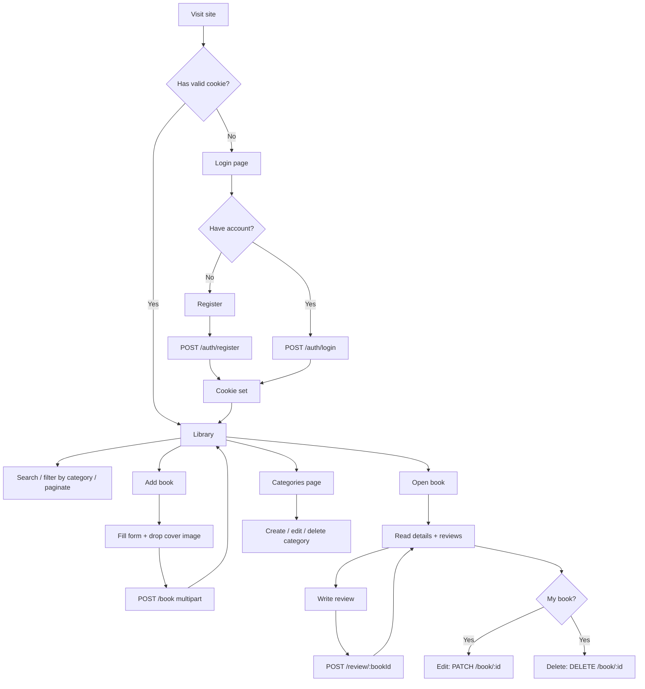

# Shelfmark: Frontend Plan for Your Book Management API

A complete build plan for the frontend of your NestJS Book Management backend. It covers the stack, the look, every user flow, and the build order in phases. "Shelfmark" is a working name, so rename it whenever you like.

---

## 1. The Decision: Use Next.js

**Stack: Next.js (App Router) + TypeScript + Tailwind CSS + shadcn/ui**

Your backend is separate (NestJS on its own port), so the frontend only has to be a great client. I picked Next.js over plain React (Vite) for these reasons:

| Reason | Why it matters for your project |
|---|---|
| **Safe JWT storage** | With Next.js route handlers you can keep the JWT in an `httpOnly` cookie. JavaScript in the browser can never read it, which is much safer than `localStorage`. |
| **No CORS headaches** | The browser only talks to Next.js. Next.js forwards requests to NestJS, so you don't have to configure CORS. |
| **Route protection** | Middleware can redirect logged-out visitors before any page renders. There is no flash of protected content. |
| **Cloudinary images** | `next/image` resizes and lazy-loads your book covers automatically. Covers are the most important visual on this site. |
| **One codebase, one deploy** | Deploy the frontend to Vercel in a few minutes. |

**Why not plain React?** It works, but you would have to solve token storage, CORS and route guards yourself. Next.js gives you all three with less work.

### Full package list

| Purpose | Package |
|---|---|
| Framework | `next`, `react`, `typescript` |
| Styling | `tailwindcss` (v4) |
| Components | `shadcn/ui` (Radix primitives, copied into your repo, so you own the code) |
| Icons | `lucide-react` |
| Animation | `motion` (formerly Framer Motion) |
| Server state (fetching and caching) | `@tanstack/react-query` |
| Forms | `react-hook-form` + `zod` + `@hookform/resolvers` |
| Toasts | `sonner` |
| Dark/light theme | `next-themes` |
| Fonts | `next/font/google` (Bricolage Grotesque + Literata) |
| JWT decoding | `jose` |
| File drop zone | `react-dropzone` |

Check each package's current version when you install. Next.js 16 renames `middleware.ts` to `proxy.ts`, so use whichever name your version expects.

---

## 2. How the Frontend Talks to Your Backend

```
Browser  ──►  Next.js (port 3001)  ──►  NestJS (port 3000)  ──►  MongoDB / Cloudinary
             │ holds JWT in httpOnly cookie
             │ adds "Authorization: Bearer <token>" for you
```

> **Port clash:** NestJS uses port 3000 by default. Run Next.js on a different port: `next dev -p 3001`.

### Two small server files do all the work

**`.env.local`**
```env
API_URL=http://localhost:3000
```

**`app/api/auth/login/route.ts`** logs in and stores the token as a cookie:
```ts
import { cookies } from "next/headers";

export async function POST(req: Request) {
  const body = await req.json();
  const res = await fetch(`${process.env.API_URL}/auth/login`, {
    method: "POST",
    headers: { "content-type": "application/json" },
    body: JSON.stringify(body),
  });
  const data = await res.json();
  if (!res.ok) return Response.json(data, { status: res.status });

  (await cookies()).set("token", data.access_token, {
    httpOnly: true,
    sameSite: "lax",
    secure: process.env.NODE_ENV === "production",
    path: "/",
    maxAge: 60 * 60 * 24 * 7, // match your JWT expiry
  });
  return Response.json({ ok: true });
}
```
Copy this pattern for `register` and add a `logout` route that deletes the cookie.

**`app/api/[...path]/route.ts`** is a catch-all proxy for everything else, including image uploads:
```ts
import { cookies } from "next/headers";
import { NextRequest } from "next/server";

async function handler(
  req: NextRequest,
  { params }: { params: Promise<{ path: string[] }> }
) {
  const { path } = await params;
  const token = (await cookies()).get("token")?.value;
  const url = `${process.env.API_URL}/${path.join("/")}${req.nextUrl.search}`;

  const headers = new Headers(req.headers);
  headers.delete("host");
  if (token) headers.set("authorization", `Bearer ${token}`);

  const res = await fetch(url, {
    method: req.method,
    headers,
    body: ["GET", "HEAD"].includes(req.method) ? undefined : req.body,
    // @ts-expect-error Node needs this when streaming a request body
    duplex: "half",
  });

  return new Response(res.body, {
    status: res.status,
    headers: { "content-type": res.headers.get("content-type") ?? "application/json" },
  });
}

export { handler as GET, handler as POST, handler as PATCH, handler as DELETE };
```

From then on, the frontend calls `fetch("/api/book?page=1&limit=12")` and never touches a token.

**Fallback if this feels like too much at first:** call NestJS directly with Axios, store the token in memory, and enable CORS in `main.ts` with `app.enableCors({ origin: "http://localhost:3001" })`. It works, but it is less secure. Move to the proxy setup later.

---

## 3. Backend Checklist (Do This Before or Alongside Phase 1)

I read your documentation and found gaps that will affect the UI. Fix these first and the frontend gets much simpler.

| # | Gap in the current API | What to change |
|---|---|---|
| 1 | **Login and register only return `access_token`.** The UI needs the author's name and ID for the avatar and greeting. | Either return `{ access_token, author: { id, name, email } }`, or decode the JWT with `jose`. Check what your `AuthService` puts in the payload (`sub`? `id`? `email`?). |
| 2 | **No way to get reviews for one book.** Only `GET /review` (all reviews) exists. | Add `GET /review?bookId=...` or `GET /book/:id/reviews`. Without it, the book page must download every review and filter in the browser. |
| 3 | **Book list doesn't say what shape it returns.** | Return `{ data: Book[], total, page, limit }` so the pagination bar can show "Page 2 of 7". |
| 4 | **Books only store `categoryId`.** Cards need the category name. | Use Mongoose `.populate("categoryId", "name")` in the list and detail endpoints. |
| 5 | **No average rating on books.** | Add a computed `averageRating` and `reviewCount` to book responses (use an aggregation). |
| 6 | **Some routes don't say "Auth required"** (delete book, update/delete category, review update/delete, author by id/email). | Confirm every one is behind `AuthGuard`. |
| 7 | **No ownership checks mentioned.** | Only the book's `userId` owner should update or delete it. The UI will hide those buttons for other authors, but the backend must enforce it. |
| 8 | **Review create URL is `/review/:id` where `id` is the book ID.** | Fine, but use `/book/:id/reviews` for cleaner URLs if you add the endpoint from #2. |
| 9 | **Mixed naming:** `/authors`, `/book`, `/category`, `/review`. | Not a bug. Keep a single `api.ts` file in the frontend so the mismatch lives in one place. |

---

## 4. Design Direction

### The idea

Books are objects with texture: cloth bindings, gold foil stamping, spines on a shelf. The interface should feel like a reading room at night. It should be dark and quiet, with the **book covers doing all the talking**.

**One memorable thing:** the covers. Cards are portrait books (2:3) that tilt in 3D toward your cursor, and the library can switch between a **Grid** view and a **Shelf** view where books stand as spines. Everything else stays calm so the covers stand out.

### Color tokens

| Name | Hex | Role |
|---|---|---|
| Midnight Ink | `#0F1A2E` | Page background |
| Deep Shelf | `#182640` | Cards, panels, inputs |
| Binding Line | `#2B3B5C` | Borders and dividers |
| Paper | `#EFE9DC` | Main text |
| Faded Paper | `#A9B0C0` | Secondary text |
| Gilt | `#E3B04B` | Primary buttons, focus rings, star ratings (gold foil) |

**Spine colors (categories):** every category is automatically assigned one of six book-cloth dyes, chosen by hashing the category name. Use this color for chips, spine views and fallback covers, so a category always looks the same.

| Dye | Hex |
|---|---|
| Oxblood | `#8E2C3A` |
| Bottle Green | `#2F6B57` |
| Cloth Blue | `#3F64B5` |
| Plum | `#7A3E7E` |
| Teal | `#2A8C97` |
| Ochre Brown | `#A66A2E` |

**Status colors:** success `#4FA37A`, danger `#D8595F`.

**Day mode (optional light theme):** background `#F3EFE6`, surface `#FFFFFF`, text `#1B2438`. Gilt stays, darkened to `#B8862A` for contrast on light backgrounds.

Put these in `globals.css` (Tailwind v4):
```css
@theme {
  --color-ink: #0F1A2E;
  --color-shelf: #182640;
  --color-binding: #2B3B5C;
  --color-paper: #EFE9DC;
  --color-faded: #A9B0C0;
  --color-gilt: #E3B04B;
  --font-display: var(--font-bricolage);
  --font-reading: var(--font-literata);
}
```

### Typography

| Role | Font | Used for |
|---|---|---|
| UI and headings | **Bricolage Grotesque** | Nav, page titles, buttons, labels, book titles on cards |
| Reading text | **Literata** (a serif designed for long reading) | Book descriptions, review comments, empty-state messages |

Rules: sentence case everywhere, line length under 75 characters for reading text, and slightly more line height on Literata (1.65) than on Bricolage (1.4).

### Layout

- **Desktop:** slim left rail with icon navigation. The main area holds a search bar at the top and the page content below it.
- **Mobile:** bottom tab bar (Library, Categories, Add, Profile). The cover grid becomes 2 columns.
- **Alignment:** left-aligned everywhere. Only empty states are centered.

```
Library (desktop)
┌────┬──────────────────────────────────────────────────┐
│ ▣  │  Search books…                     [Grid|Shelf]   │
│ ▤  │  ( All ) ( Fiction ) ( Full Stack ) ( Poetry )…   │
│ ▥  │                                                   │
│    │  ┌────┐ ┌────┐ ┌────┐ ┌────┐ ┌────┐              │
│    │  │    │ │    │ │    │ │    │ │    │              │
│ ☾  │  │cvr │ │cvr │ │cvr │ │cvr │ │cvr │              │
│ ◉  │  └────┘ └────┘ └────┘ └────┘ └────┘              │
│    │  Title   Title  Title  Title  Title               │
│    │  Author  Author Author Author Author              │
│    │                         ‹ 1 2 3 … 7 ›             │
└────┴──────────────────────────────────────────────────┘

Book detail
┌──────────────────────────────────────────────────────┐
│  ┌──────────┐   Hamlet                    [Edit][Del] │
│  │          │   William Shakespeare                   │
│  │  cover   │   ★ 4.2 · 18 reviews · Full Stack       │
│  │ (sticky) │   ISBN 978-0-7432-7356-5                │
│  └──────────┘  ───────────────────────────────────   │
│                Reviews                  [Write one]   │
│                ★★★★☆  "Comment…"  — Author name       │
└──────────────────────────────────────────────────────┘
```

### Motion (used sparingly)

1. **One orchestrated moment:** the first time the library loads, covers rise into place with a short stagger. It plays once per visit.
2. **Answers to user actions:** cover tilt on hover, dialogs that scale in, a star that fills when clicked, a toast sliding in after save. Keep these to 150–250 ms.
3. **Nothing else moves by itself.** No floating blobs and no scroll-triggered fade-ins on every section.
4. Respect `prefers-reduced-motion`. Turn off the tilt and the stagger when it is set.

### Special touches that fit this project

- **Generated fallback covers:** a book with no image gets a cover made from its category's spine color, the title set in Bricolage, and a thin gilt border.
- **Command search (`Ctrl/⌘ + K`):** jump to any book, category or page.
- **Login page:** split screen. The left side shows a slow, muted wall of covers from your real books, or generated covers if there are none. The right side holds the form.
- **Star rating input:** hover previews the rating, click fills the stars in gilt.

### Copy rules (how the interface talks)

- Buttons say what happens: **Add book**, **Save changes**, **Delete book**. Never "Submit".
- The same word is used everywhere. If the button says "Publish", the toast says "Published".
- Errors say what happened and how to fix it. Example: *"That ISBN is already in your library. Check the number or edit the existing book."*
- Empty states invite an action. Example: *"No books on this shelf yet. Add your first one."*

---

## 5. Sitemap and User Flows

### Sitemap

```
/                     → redirects to /library (or /login if logged out)
/login
/register
/library              → all books, filters, grid/shelf
/library/new          → add a book
/library/[id]         → book detail + reviews
/library/[id]/edit    → edit a book
/categories           → manage categories
/authors              → browse authors
/authors/[id]         → author profile + their books
/profile              → my profile and my books
```

### Main flow



### Every flow, in detail

| Flow | Steps | Endpoint(s) |
|---|---|---|
| **Register** | Fill name, email, password and "your signature book" → validate → create account → cookie set → land on Library | `POST /auth/register` |
| **Login** | Email and password → cookie set → Library | `POST /auth/login` |
| **Logout** | Click avatar menu → Log out → cookie deleted → Login page | (Next route only) |
| **Session expired** | Any request returns 401 → clear cookie → redirect to Login with a "Session expired. Log in again." toast | any |
| **Browse books** | Type in search, click category chip, change page → URL updates (`?title=&categoryId=&page=`) so links can be shared | `GET /book` |
| **Add book** | Title, author (pre-filled with your name), ISBN, category (dropdown), cover (drop zone with preview) → upload progress → toast → book page | `GET /category`, `POST /book` |
| **Edit book** | Same form, pre-filled. Changing the image is optional. Without a new image, send JSON. With one, send multipart. | `GET /book/:id`, `PATCH /book/:id` |
| **Delete book** | Confirm dialog naming the book → delete → back to Library | `DELETE /book/:id` |
| **View book** | Cover, details, average rating, list of reviews | `GET /book/:id`, reviews endpoint |
| **Write review** | Star picker + comment → optimistic add to the list → toast | `POST /review/:bookId` |
| **Edit or delete my review** | Only shown on reviews you wrote | `PATCH /review/:id`, `DELETE /review/:id` |
| **Manage categories** | List with color swatch → dialog to create or edit → delete with confirm | `GET/POST /category`, `PATCH/DELETE /category/:id`, `PATCH /category/upsert/:id` |
| **Browse authors** | List of authors → profile with their books | `GET /authors`, `GET /authors/:id`, `GET /authors/email/:email` |

---

## 6. Folder Structure

```
shelfmark/
├─ app/
│  ├─ (auth)/
│  │  ├─ login/page.tsx
│  │  └─ register/page.tsx
│  ├─ (app)/                      ← everything behind login
│  │  ├─ layout.tsx               ← rail nav, search bar, providers
│  │  ├─ library/
│  │  │  ├─ page.tsx
│  │  │  ├─ new/page.tsx
│  │  │  └─ [id]/
│  │  │     ├─ page.tsx
│  │  │     └─ edit/page.tsx
│  │  ├─ categories/page.tsx
│  │  ├─ authors/
│  │  │  ├─ page.tsx
│  │  │  └─ [id]/page.tsx
│  │  └─ profile/page.tsx
│  ├─ api/
│  │  ├─ auth/{login,register,logout,me}/route.ts
│  │  └─ [...path]/route.ts       ← the proxy
│  ├─ globals.css
│  └─ layout.tsx                  ← fonts, theme
├─ components/
│  ├─ ui/                         ← shadcn components
│  ├─ book/    BookCard, BookSpine, BookCover, BookGrid, BookForm, CoverDropzone
│  ├─ review/  ReviewList, ReviewForm, StarRating
│  ├─ category/ CategoryChip, CategoryDialog
│  └─ shell/   RailNav, MobileTabs, CommandSearch, ThemeToggle, UserMenu
├─ lib/
│  ├─ api.ts                      ← typed fetch functions (one place for all endpoints)
│  ├─ hooks/                      ← useBooks, useBook, useCategories, useReviews…
│  ├─ schemas.ts                  ← zod schemas
│  ├─ spine-color.ts              ← name → dye color
│  └─ types.ts                    ← Book, Author, Category, Review
├─ proxy.ts (or middleware.ts)    ← redirect if no cookie
└─ .env.local
```

---

## 7. Build Phases

Each phase ends with something you can open in the browser and use. Time estimates assume a beginner working a few hours a day.

### Phase 0: Foundations (about 1 day)

**Goal:** a blank app with your look already in place, connected to the backend.

- [ ] Create the app: `npx create-next-app@latest shelfmark` (TypeScript, Tailwind, App Router)
- [ ] Set up shadcn/ui: `npx shadcn@latest init`, then add `button input label dialog dropdown-menu select skeleton sonner tabs command`
- [ ] Add the color tokens and both fonts (section 4)
- [ ] Add `next-themes` and a theme toggle (dark by default)
- [ ] Create `.env.local` and the proxy route (section 2)
- [ ] Write `lib/types.ts` and `lib/api.ts` with one function per endpoint
- [ ] Wrap the app in `QueryClientProvider`

**Done when:** a temporary page shows your books from `GET /book` in plain text.

### Phase 1: Authentication (about 1–2 days)

**Goal:** register, log in and log out. Protected pages redirect.

- [ ] Login page: split screen with cover wall on the left and the form on the right
- [ ] Register page: name, email, password, "signature book" (your API's `book` field)
- [ ] Zod validation with clear inline errors (invalid email, password under 6 characters)
- [ ] `/api/auth/login`, `/register`, `/logout`, `/me` route handlers
- [ ] Middleware: no cookie means redirect to `/login`. A cookie on `/login` means redirect to `/library`.
- [ ] Global 401 handling: clear the session and redirect with a toast

**Done when:** you can register, get redirected into the app, log out, and can't open `/library` while logged out.

### Phase 2: App shell (about 1 day)

**Goal:** the frame around every page.

- [ ] Left rail (desktop) and bottom tab bar (mobile)
- [ ] User menu with avatar initials, name, and Log out
- [ ] Theme toggle
- [ ] Command search (`Ctrl/⌘ + K`), which can start out as page navigation only
- [ ] Toast provider, page-level error boundary, and a 404 page

**Done when:** you can move between empty pages on both a phone-sized and a desktop-sized window.

### Phase 3: The Library (about 2–3 days)

**Goal:** the main screen, and the one that makes the site look impressive.

- [ ] `BookCard` with 2:3 cover, title, author, and category chip
- [ ] Cover tilt on hover (a small `motion` component), disabled for reduced motion
- [ ] Fallback cover generator for books without an image
- [ ] Search box with debounce (300 ms), which updates `?title=`
- [ ] Category chips in spine colors, which update `?categoryId=`
- [ ] Pagination bar driven by `total`, `page` and `limit`
- [ ] Grid and Shelf view toggle (Shelf shows vertical spines with title text rotated)
- [ ] Loading skeletons in the shape of cards
- [ ] Empty state: "No books match. Clear filters or add a new book."
- [ ] The one-time staggered entrance of covers

**Done when:** filters and page numbers survive a browser refresh and a copied link.

### Phase 4: Add and edit books (about 2 days)

**Goal:** create and edit with a proper image upload.

- [ ] `BookForm` shared by `/library/new` and `/library/[id]/edit`
- [ ] `CoverDropzone`: drag and drop, image preview, and a client check for jpeg, jpg, png, webp and gif (the same types your backend allows) with a file-size limit
- [ ] Category select loaded from `GET /category`, with a "Create a new category" shortcut
- [ ] Author field pre-filled with the logged-in author's name
- [ ] Submit as `FormData` for create. For edit, send JSON when there is no new image and `FormData` when there is.
- [ ] Upload progress or a clear "Uploading cover…" state
- [ ] After saving: invalidate the books query, toast "Book added", and go to the book page
- [ ] Show backend validation errors (such as a duplicate ISBN) under the right field

**Done when:** you can add a book with a cover, see it in the library, edit it with and without a new image, and see the image update.

### Phase 5: Book detail and reviews (about 2 days)

**Goal:** a page people want to linger on.

- [ ] Two-column layout: sticky cover on the left, details on the right
- [ ] Metadata: author, ISBN, category chip, average rating, review count
- [ ] Edit and Delete buttons, shown only if the book's `userId` matches the logged-in author
- [ ] Delete confirm dialog that names the book
- [ ] `ReviewList` with rating summary, and `ReviewForm` with star input
- [ ] Optimistic review add with TanStack Query (shows instantly, rolls back on failure)
- [ ] Edit and delete only on your own reviews
- [ ] Reviews set in Literata for a "reading" feel

**Done when:** you can review a book, see the average update, and delete your own review.

### Phase 6: Categories (about 1 day)

**Goal:** manage the groupings that drive the colors.

- [ ] Category list showing spine color swatch, name, description, and book count
- [ ] Create and edit in a dialog (React Hook Form + Zod)
- [ ] Delete with confirm. Warn if books use this category.
- [ ] Use the upsert endpoint for the "create or update" behavior if you want a single form flow

**Done when:** a new category appears immediately in the library filter chips and in the Add book dropdown.

### Phase 7: Authors and profile (about 1–2 days)

**Goal:** make it feel like a community of authors.

- [ ] `/authors`: grid of author cards with initials avatar, name, signature book
- [ ] `/authors/[id]`: profile header plus that author's books (filter the book list by `userId`, or add the endpoint)
- [ ] `/profile`: your own info, your books, and small stats (total books, categories used, reviews received)
- [ ] Optional home strip in the Library: "Recently added" and "Top rated"

**Done when:** you can click an author's name on any book and land on their profile.

### Phase 8: Polish (about 2 days)

**Goal:** the difference between a class project and something you'd show off.

- [ ] Keyboard focus rings in gilt on every interactive element
- [ ] Full keyboard use of command search and dialogs
- [ ] Check contrast in both themes (aim for WCAG AA)
- [ ] Reduced-motion pass across all animations
- [ ] Image sizes: add `res.cloudinary.com` to `images.remotePatterns` in `next.config.ts` and set proper `sizes` on covers
- [ ] Error states for a network failure, the backend being down, and a 404 book
- [ ] Mobile pass on every page at 360 px wide
- [ ] `loading.tsx` and `error.tsx` for each route
- [ ] Page titles and Open Graph tags
- [ ] Copy pass: read every button, toast and empty state against the copy rules in section 4

**Done when:** you can use the whole app on a phone with no layout breaks and no console errors.

### Phase 9: Ship (about 1 day)

- [ ] Deploy the NestJS API (Render, Railway or Fly.io) with your `.env` values, and use MongoDB Atlas for the database
- [ ] Deploy Next.js to Vercel and set `API_URL` to your deployed API
- [ ] Turn on the `secure` cookie flag (already handled by the `NODE_ENV` check)
- [ ] Add rate limiting and `helmet` on the NestJS side
- [ ] Smoke test: register, add a book with a cover, review it, delete it

---

## 8. Suggested Order if You Only Have a Weekend

Phases 0, 1, 2, 3 and 4 give you a working app: log in, browse, add books with covers. Add 5 and 6 next. Leave 7 and 8 for later.

---

## 9. Working with an AI Assistant on This

Paste this plan into your assistant first, then work one phase at a time. A good prompt looks like this:

> Here is my frontend plan and my backend documentation. We are on **Phase 3: The Library**. Use Next.js App Router, Tailwind v4, shadcn/ui and TanStack Query, and the color and font tokens from section 4. Build the `BookCard`, the filter chips and the pagination bar. Explain each file briefly before writing it.

Tips:
- Finish and test one phase before starting the next.
- If something breaks, paste the exact error and the file it came from.
- Ask for one component at a time. Small requests give code you can understand and edit.
- Commit to Git at the end of every phase so you can always go back.

---

## 10. Quick Reference: Screen to Endpoint Map

| Screen | Calls |
|---|---|
| Login / Register | `POST /auth/login`, `POST /auth/register` |
| Library | `GET /book?title&categoryId&page&limit`, `GET /category` |
| Add / Edit book | `GET /category`, `POST /book`, `PATCH /book/:id`, `GET /book/:id` |
| Book detail | `GET /book/:id`, reviews for that book (see backend checklist #2), `POST /review/:bookId`, `PATCH/DELETE /review/:id`, `DELETE /book/:id` |
| Categories | `GET/POST /category`, `PATCH/DELETE /category/:id`, `PATCH /category/upsert/:id` |
| Authors | `GET /authors`, `GET /authors/:id`, `GET /authors/email/:email` |
